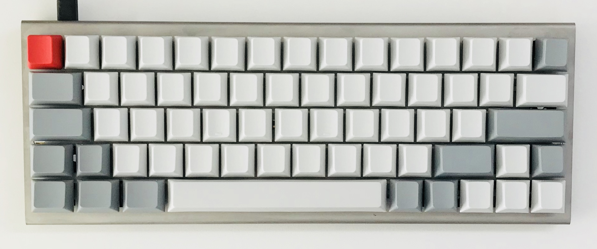

# Mingjie's First XD60 Custom Keyboard

## Keymap

### Layer 0

| 0     | 1     | 2     | 3 | 4 | 5 | 6 | 7 | 8 | 9 | 10 | 11 | 12 | 13 | 14 |
| :---: | :---: | :---: |:-:|:-:|:-:|:-----:|:-:|:-:|:--:|:--------:|:--:|:------:|:----:|:-----:|
|   ESC   |  1   |    2     | 3 | 4 | 5 |   6   | 7 | 8 | 9  |    0     | -_ |   =+   | DEL  | BSPC  |
|   TAB   |  Q   |    W     | E | R | T |   Y   | U | I | O  |    P     | [{ |   ]}   |      |  \|   |
| Fn/Caps |  A   |    S     | D | F | G |   H   | J | K | L  |    ;:    | '" |        |      | Enter |
| LShift  |  `~  |    Z     | X | C | V |   B   | N | M | |< |    .>    |    | RShift |  Up  | TO(1) |
|  LCtrl  | LAlt | LCommand |   |   |   | Space |   |   |    | RCommand | Fn |  Left  | Down | Right |

### Layer 1

| 0     | 1     | 2       | 3        | 4           | 5     | 6      | 7     | 8     | 9     | 10    | 11    | 12    | 13    | 14    |
| :---: | :---: | :-----: | :------: | :---------: | :---: | :----: | :---: | :---: | :---: | :---: | :---: | :---: | :---: | :---: |
| `~    | F1    | F2      | F3       | F4          | F5    | F6     | F7    | F8    | F9    | F10   | F11   | F12   | Trans | Trans |
| Trans | Trans | SCR2DSK | Finder   | Trans       | Trans | Insert | Pg Up | Pg Dn | Trans | Play  | Prev  | Next  | DFU   |       |
| Trans | F4    | SCR2CLP | F11      | Full Screen | Trans | Home   | End   | Trans | Lock  | F14   | F15   | NO    | LBtn  |       |
| Trans | Trans | RGB_MOD | RGB_RMOD | Trans       | Trans | Trans  | Trans | MUTE  | VOLD  | VOLU  | NO    | Trans | MS_U  | TO(0) |
| Trans | Trans | Trans   |          |             |       | Trans  |       |       |       | Trans | Trans | MS_L  | MS_D  | MS_R  |

## Features

### Use Underglow as Caps Lock and Layer Indicator

| Layer | Caps Lock | Underglow |
| :---: | :-------: | :-------- |
| 0     | off       | off       |
| 0     | on        | coral     |
| 1     | off       | turquoise |
| 1     | on        | magenta   |

## Photos

